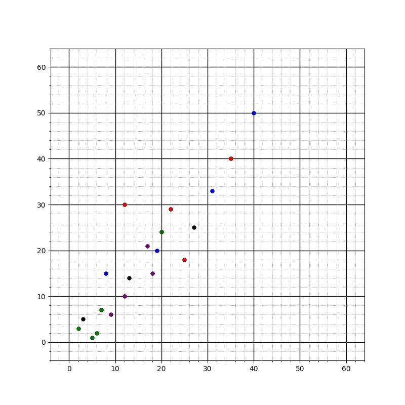
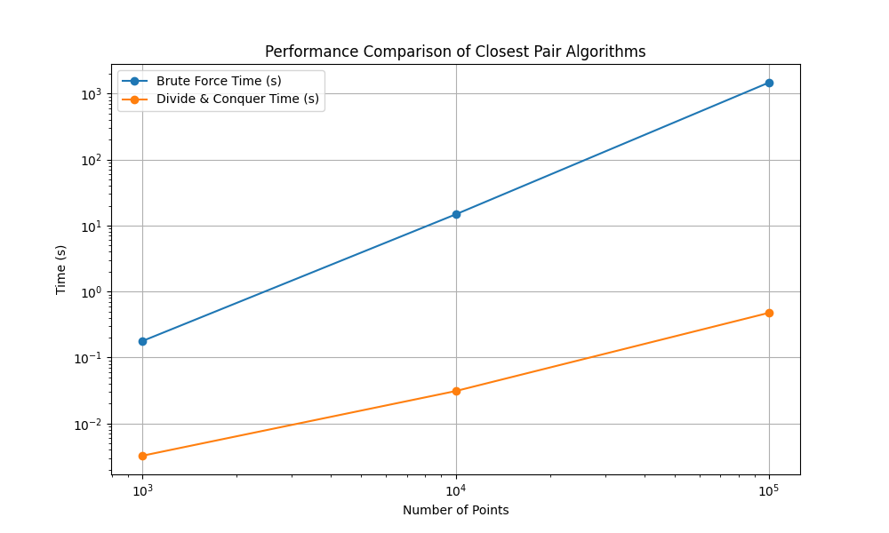

# Closest Pair of Points Algorithm in Computational Geometry

<p align="center">
  
  
  
</p>


> **Note:**
> Example problem and solution based on Dr. Mohm Azwan Bin Mohammad Hamza's assignment "Algorithm & Complexity"

An advanced and comprehensive implementation of the **Closest Pair of Points** problem using the **Divide and Conquer** algorithm in computational geometry. This project provides an in-depth exploration of efficient algorithms for solving proximity problems in a two-dimensional plane, focusing on optimizing performance for large-scale datasets.

## Table of Contents

- [Introduction](#introduction)
- [Problem Statement](#problem-statement)
- [Case Study Questions](#case-study-questions)
- [Features](#features)
- [Dataset](#dataset)
- [Algorithm Implementation](#algorithm-implementation)
- [Step-by-Step Solution](#step-by-step-solution)
- [Time Complexity Analysis](#time-complexity-analysis)
- [Usage](#usage)
- [Performance Evaluation](#performance-evaluation)
- [Real-World Applications](#real-world-applications)
- [Critical Evaluation](#critical-evaluation)
- [Conclusion](#conclusion)
- [License](#license)

## Introduction

Computational geometry is a foundational field in computer science that deals with algorithms and data structures for solving geometric problems. One of the classic challenges in this domain is determining the **Closest Pair of Points** in a two-dimensional plane. Efficiently solving this problem is crucial for applications such as **GPS navigation systems**, **machine learning clustering algorithms**, **image processing**, **wireless network optimization**, and **robotics**.

This project implements the **Divide and Conquer** algorithm to address the Closest Pair of Points problem effectively, reducing the time complexity from $O(n^2)$ (as seen in the brute-force method) to $O(n \log n)$. This optimization is significant when handling large datasets where performance is a critical factor.

## Problem Statement

### Closest Pair of Points Problem

The **Closest Pair of Points** problem involves finding the pair of points with the minimum Euclidean distance between them within a set of points on a 2D plane.

#### Euclidean Distance Calculation

For any two points $P_1 (x_1, y_1)$ and $P_2 (x_2, y_2)$, the Euclidean distance $d$ is calculated as:

$$
d = \sqrt{(x_2 - x_1)^2 + (y_2 - y_1)^2}
$$

This formula measures the "straight line" distance between two points in Euclidean space.

### Inefficiency of Brute-Force Approach

The brute-force method compares every possible pair of points to find the minimum distance, resulting in a time complexity of $O(n^2)$. This quadratic growth becomes computationally expensive and impractical for large datasets due to the substantial number of comparisons required.

## Case Study Questions

*Detailed answers to the following questions are available in the [`/doc`](./doc/) folder.*

1. **Problem Understanding**
   - Definition of the problem.
   - Euclidean distance calculation.
   - Inefficiency of the brute-force approach.

2. **Divide and Conquer Approach**
   - Process explanation.
   - The three main steps: Divide, Conquer, Combine.
   - Implementation of the 'strip' optimization.

3. **Solve the Problem**
   - Step-by-step solution using the provided dataset.

4. **Time Complexity Analysis**
   - Comparison between $O(n \log n)$ and $O(n^2)$ time complexities.

5. **Algorithm Implementation**
   - Code construction in Python.
   - Execution on datasets containing 1,000, 10,000, and 100,000 points.

6. **Performance Comparison**
   - Evaluation of the Divide and Conquer approach versus the brute-force method.

7. **Real-World Applications**
   - Five practical applications of the Closest Pair of Points algorithm.

8. **Critical Evaluation**
   - Strengths, limitations, and potential trade-offs of the algorithm.

## Features

- **Efficient Algorithm Implementation**: Leverages the Divide and Conquer strategy for optimal performance.
- **Scalability**: Effectively handles large datasets; tested with up to 100,000 points.
- **Modular and Clean Code**: Written in Python with emphasis on readability and maintainability.
- **Comprehensive Documentation**: Provides detailed explanations and analyses.
- **Performance Analysis Tools**: Includes scripts to compare and visualize algorithm performance.

## Dataset

The algorithm operates on a set of 2D points with associated labels. Below is the sample dataset:

```python
points = [
    ("green", 2, 3),
    ("green", 5, 1),
    ("green", 6, 2),
    ("green", 7, 7),
    ("green", 20, 24),
    ("black", 3, 5),
    ("black", 13, 14),
    ("black", 27, 25),
    ("purple", 9, 6),
    ("purple", 12, 10),
    ("purple", 17, 21),
    ("purple", 18, 15),
    ("blue", 8, 15),
    ("blue", 19, 20),
    ("blue", 31, 33),
    ("blue", 40, 50),
    ("red", 12, 30),
    ("red", 22, 29),
    ("red", 25, 18),
    ("red", 35, 40),
]
```

A visual representation of this dataset helps understand the spatial distribution of points across the plane.

<p align="center">
  
</p>

## Algorithm Implementation

The project is implemented in **Python**, utilizing its robust libraries and simplicity for algorithm development.

### Divide and Conquer Algorithm Steps

1. **Divide**

   - **Sorting**: Sort the points based on their x-coordinates.
   - **Partitioning**: Divide the sorted set into two equal halves.

2. **Conquer**

   - **Recursive Processing**: Recursively apply the algorithm to both halves to find the minimum distances $d_L$ and $d_R$.
   - **Base Case**: When subsets are small (typically 2 or 3 points), use the brute-force method.

3. **Combine**

   - **Find Minimal Distance**: Determine the minimal distance $d = \min(d_L, d_R)$.
   - **Strip Creation**: Build a strip of points within distance $d$ from the central dividing line.
   - **Strip Optimization**: Sort the strip points based on y-coordinates and check for closer pairs.

#### Strip Optimization

- **Purpose**: Efficiently find the closest pair across the partition.
- **Implementation**:
  - **Create Strip**: Collect points that lie within distance $d$ of the dividing line.
  - **Sort Strip**: Sort these points based on their y-coordinates.
  - **Compare Points**: For each point in the strip, compare it with the next seven points to find the closest pair.

## Step-by-Step Solution

A detailed step-by-step solution for the provided dataset is available in the [`/doc`](./doc). It includes:

- **Sorting Points**: Demonstrates the initial sorting by x and y coordinates.
- **Dividing Dataset**: Explains how the dataset is recursively partitioned.
- **Calculating Closest Pair**: Shows how the closest pairs are found within subsets.
- **Combining Results**: Describes how the minimal distances are compared across the partitions.

## Time Complexity Analysis

### Divide and Conquer Algorithm ($O(n \log n)$)

- **Initial Sorting**: Takes $O(n \log n)$ time.
- **Recursive Division**: Creates $\log n$ levels of recursion.
- **Combine Step**: At each level, the strip processing takes $O(n)$ time.
- **Overall Complexity**: The combination of sorting and recursive steps results in $O(n \log n)$ time complexity.

### Brute-Force Method ($O(n^2)$)

- **Pairwise Comparison**: Every pair of points is compared.
- **Total Comparisons**: $\frac{n(n - 1)}{2}$ comparisons, leading to quadratic time growth.

### Comparative Analysis

The Divide and Conquer method substantially outperforms the brute-force approach for large $n$, as it reduces the number of necessary comparisons and scales logarithmically.

## Usage

### Installation

Ensure that **Python 3.x** is installed on your system.

1. **Clone the Repository**

   ```bash
   git clone https://github.com/IRedDragonICY/cb24153-closestpairofpoints.git
   ```

2. **Navigate to the Project Directory**

   ```bash
   cd cb24153-closestpairofpoints
   ```

3. **Create a Virtual Environment (Optional)**

   ```bash
   python3 -m venv venv
   source venv/bin/activate  # On Windows: venv\Scripts\activate
   ```

4. **Install Dependencies**

   ```bash
   pip install -r requirements.txt
   ```

### Running the Algorithm

To run the algorithm, you need to execute three Python scripts: `case-bigdataset.py`, `case-plot.py`, and `case-plot-step.py`. Follow the steps below to ensure everything runs smoothly:

1. **Ensure Dependencies are Installed**

   ```bash
   pip install -r requirements.txt
   ```

2. **Run the Scripts**

   ```bash
   python src/case-bigdataset.py
   python src/case-plot.py
   python src/case-plot-step.py
   ```

   Each script has a specific role:
   - `case-bigdataset.py`: Evaluates the performance of the brute force and divide & conquer methods on larger datasets.
   - `case-plot.py`: Plots the performance results of the algorithms.
   - `case-plot-step.py`: Provides a step-by-step visualization of the algorithm's execution.

By following these steps, you will be able to run the algorithm and visualize the results effectively.

## Performance Evaluation

### Result Summary

| Number of Points | Brute Force Distance | Brute Force Time (s) | Divide & Conquer Distance | Divide & Conquer Time (s) |
|------------------|----------------------|----------------------|---------------------------|---------------------------|
| 1,000            | 952.135495          | 0.178031             | 952.135495                | 0.003254                  |
| 10,000           | 30.413813           | 14.760878            | 30.413813                 | 0.031042                  |
| 100,000          | 11.401754           | 1465.536086          | 11.401754                 | 0.475594                  |

### Observations

- **Efficiency Gains**: The Divide and Conquer algorithm dramatically reduces computation time.
- **Scalability**: Maintains reasonable execution times even as the dataset size increases significantly.
- **Practically Feasible**: The brute-force method becomes impractical for datasets larger than 10,000 points.

### Graphical Representation

<p align="center">
  
</p>

*The graph illustrates the execution time vs. number of points for both algorithms.*

## Real-World Applications

1. **GPS Navigation Systems**
   - **Nearest Neighbor Search**: Finding the closest service location.
   - **Route Optimization**: Calculating the shortest path by evaluating proximity between waypoints.

2. **Machine Learning Clustering**
   - **Data Analysis**: Grouping similar data points for pattern recognition.
   - **Anomaly Detection**: Identifying outliers based on distance metrics.

3. **Image Processing**
   - **Feature Matching**: Aligning images by matching key points.
   - **Object Recognition**: Detecting and classifying objects within images.

4. **Wireless Network Optimization**
   - **Network Design**: Placing transmitters for optimal coverage.
   - **Signal Strength Mapping**: Analyzing proximity to access points.

5. **Robotics**
   - **Obstacle Avoidance**: Real-time detection of nearby obstacles.
   - **Path Planning**: Determining efficient paths to targets.

## Critical Evaluation

### Strengths

- **High Efficiency**: Significantly reduces computation time for large datasets.
- **Wide Applicability**: Useful in various domains requiring proximity calculations.
- **Foundational Knowledge**: Enhances understanding of computational geometry techniques.

### Limitations

- **Algorithm Complexity**: More complex to implement compared to the brute-force method.
- **Dimensionality**: Efficiency gains diminish in higher-dimensional spaces.

### Potential Trade-Offs

- **Development Time**: More time needed for coding and debugging.
- **Memory Usage**: Increased memory usage due to recursion and additional data structures.

## Conclusion

The **Divide and Conquer** algorithm offers a powerful and efficient solution to the Closest Pair of Points problem, especially for large datasets. Its implementation in this project demonstrates significant performance improvements over the brute-force method, making it highly suitable for real-world applications that demand quick and reliable proximity calculations.

## License

This project is licensed under the **MIT License**. See the [LICENSE](LICENSE) file for detailed information.

---

*For comprehensive answers to the case study questions, theoretical explanations, and additional resources, please refer to the [`/doc`](./doc/) folder.*

---

<p align="center">
  <strong><em>Empowering efficient computational geometry solutions for complex proximity problems.</em></strong>
</p>